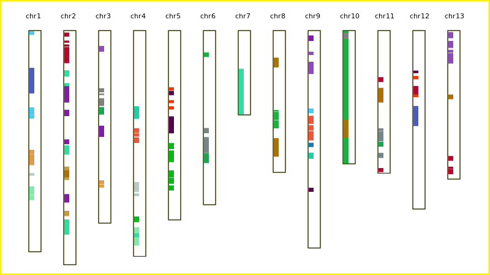

# chrVis
Visualize genes or LinkageMap on chromesomes

## Requirements

The script requires python module : svgwrite

install with pip:

```
pip install svgwrite`
```

or from source:

```
python setup.py install
```

## sample command line

`python App.py --conf sample.conf --out sample_out.svg`

## Usage


```
usage: App.py [-h] [-c CONF] [-o OUT]

optional arguments:
  -h, --help            show this help message and exit
  -c CONF, --conf CONF  configure file
  -o OUT, --out OUT     output filename
```

## sample configure file

```
[general]
karyotype = sample_chr.txt
bandfile = sample_gene.txt

scale = 50000
imgWidth = 1200
imgHeight = 600

[ideogram]
thickness = 20
spacing = 80
fill      = yes
label_size = 20

[band]
alpha = 1
thickness = 10
show_name = True
```


## sample karyotype file

Three columns `chromosome ID`,`chromesome name` , `chromosome length`, `chromosome color`


```
chr1  My.Chr1 28954470  #333300
chr2  My.Chr2 30652350  #333300
chr3  My.Chr3 25211582  #333300
chr4  My.Chr4 29556843  #333300
chr5  My.Chr5 24787886  #333300
chr6  My.Chr6 22802870  #333300
chr7  My.Chr7 11041128  #333300
chr8  My.Chr8 18570557  #333300
chr9  My.Chr9 28466655  #333300
chr10 My.Chr10  17444910  #333300
chr11 My.Chr11  18674527  #333300
chr12 My.Chr12  23362826  #333300
chr13 My.Chr13  19446246  #333300
```


## sample bandfile file

Five columns `chromosome name` , `band name`,`band start`,`band end`, `fill color`

```
chr1  block0  18655440  19004551  #bacac6
chr4  block63 21300577  21681252  #bacac6
chr4  block64 19835040  21134129  #bacac6
chr4  block65 24342697  25086406  #00bc12
chr5  block73 15698017  17228364  #00bc12
chr5  block74 19286756  20060843  #00bc12
chr5  block75 14726663  15515996  #00bc12
chr5  block76 18302344  19240018  #00bc12
chr5  block77 20273832  20935547  #00bc12
chr10 block11 0 17444910  #0eb83a
chr6  block84 2855768 3460898 #0eb83a
chr8  block91 10654172  11720140  #0eb83a
chr8  block92 11768805  12802006  #0eb83a
chr8  block93 10394348  10605509  #0eb83a
chr11 block18 14537869  15203608  #16a951
chr3  block55 10019219  11003401  #16a951
chr6  block85 16028585  17345205  #16a951
chr4  block66 13980220  14717750  #f35336
chr4  block67 13448043  13874835  #f35336
chr4  block68 12779674  13388859  #f35336
chr9  block96 13165043  14384072  #f35336
chr9  block97 11152423  12218998  #f35336
chr9  block98 12392176  13083726  #f35336
```

## sample output


